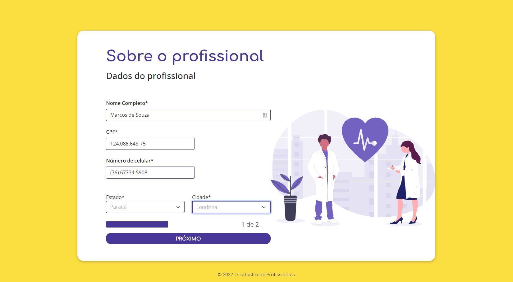
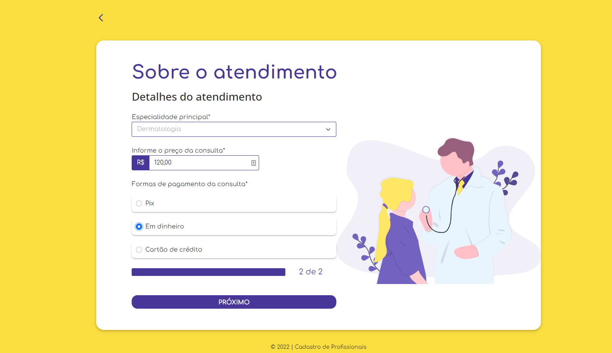
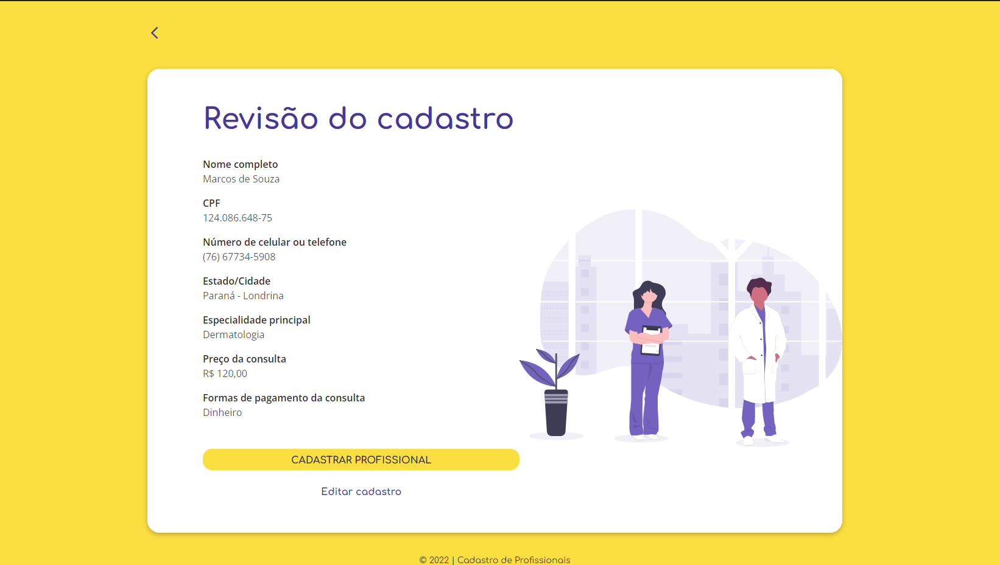
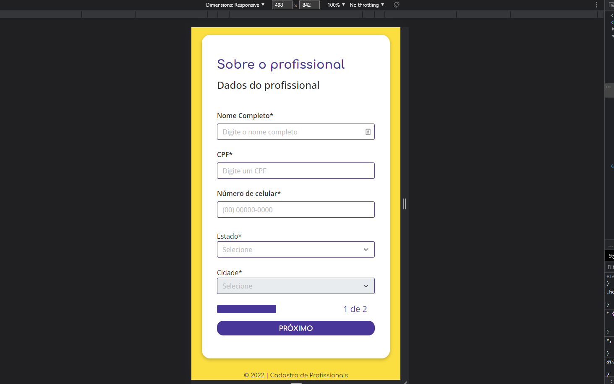

# **Cadastro profissionais - Vue JS**

 

## **O propósito do projeto**

O objetivo desse app é permitir o usuário fornecer dados nos campos que são obrigatórios para a progressão e ao chagar ao final do cadastro
todos os dados serão apresentados e assim começar outro processo de cadastro.
Os campos estão validados e caso um dados não seja fronecido ou esteja erro um erro será apresentado e só haverá progressão caso os dados estejam corretos. Se tudo for feito corretamente no final o usuário terá feito seu cadastro com sucesso.

## **Funcionalidades**

Na página inicial é apresentado os campos de preenchimento de dados do usuário e só é liberado o progresso caso todos os campos
estejam devidamente preenchidos.
O usuário terá que digitar um nome de 3 a 48 caracteres, um CPF com todos os 11 dígitos, um número de telefone com 11 dígitos, selecionar um estado para que seja liberado um cidade referente ao estado escolhido.

Na segunda página o usuário é apresentado a ovos campos de preenchimento onde é necessário selecionar uma especialidade profissional,
um valor entre 30,00 a 350,00, uma forma de pagamento e caso escolha "Cartão de crédito", haverá as opções de parcelas.

Na terceira página será apresentado todos os dados fornecidos pelo usuário onde é possível voltar à página inicial clicando em "Editar cadastro" para editar qualquer dado caso o usuário deseje. No top de cada página há um botão que levará o usuário à página anterior para mudar algum dado e assim proseguir novamente.
Ao clicar em "Cadastra profissional" o usuário é direcionado à página de agradecimento e ao clicar no notão "Fazer novo cadastro" se reinicia todo o processo navamente.

## **Tecnologias usadas**

- <a href="https://vuejs.org">Vue JS</a>
- <a href="https://router.vuejs.org">Vue Router</a>
- <a href="https://sweetalert2.github.io/#examples">SweetAlert2</a>
- <a href="https://axios-http.com/ptbr/docs/intro">Axios</a>
- <a href="https://vuejs-tips.github.io/vue-the-mask">Vue the mask</a>
- <a href="https://www.npmjs.com/package/vue-toast-notification">Vue Toast Notification</a>

## **Como instalar em ambiente local**

- Na página desse projeto no Github clique em "Code", baixe o Zip ou copie o link do HTTPS.
- Abra um terminal em uma pasta de sua escolha e cole o link HTTPS.
- Certifique-se de ter instalado o Node em uma versão superior a 14.0.
- Após baixar o pojeto em um diretório de sua escolha digite o comando "npm install".
- Após o término de todas as depedências serem baixadas pelo npm digite no mesmo diretório o comando "npm run serve".
- Digite o seguinte comando "http://localhost:8080" no navegador.

## **Screenshots**

- Página inicial
  

- Página de atendimento
  

- Página de Revisão
  

- Página de agradecimento
  

- Versão mobile
  
